# 第二章 图表复现（Python 版）

用 Python（Matplotlib）复现《第二章 图表》中的 30 种 Excel 商务图表，
数据与 Excel 文件完全一致，每个图表对应一个可独立运行的脚本。

## 目录结构

```
├── charts/          # 30 个图表脚本 + common.py（公共样式与工具函数）
├── images/          # 运行脚本后生成的图表（PNG + SVG）
├── requirements.txt
└── README.md
```

## 快速开始

```bash
pip install -r requirements.txt

# 运行任意一个图表脚本，图片会保存到 images/ 目录
python charts/01_渐变柱形图.py

# 一键运行全部 30 个脚本
python run_all.py
```

## 效果图

下表中的效果图位于 `images/` 目录（SVG 矢量图）。本地克隆仓库后若还没有图片，先运行 `python run_all.py` 即可全部生成（PNG + SVG 各一份）。

## 图表清单

| # | 图表 | 脚本 | 效果 |
|---|------|------|------|
| 01 | 渐变柱形图 | `charts/01_渐变柱形图.py` | 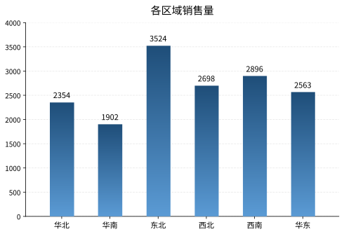 |
| 02 | 带均值柱形图 | `charts/02_带均值柱形图.py` | 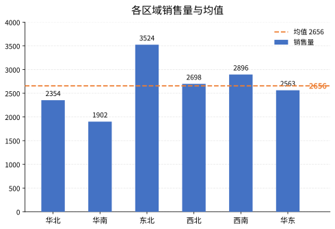 |
| 03 | 渐变圆角柱形图 | `charts/03_渐变圆角柱形图.py` | 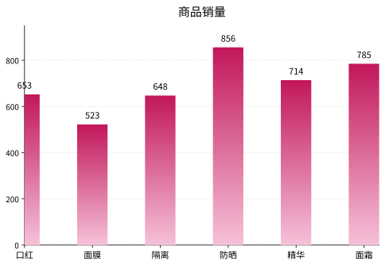 |
| 04 | 标注柱形图 | `charts/04_标注柱形图.py` | 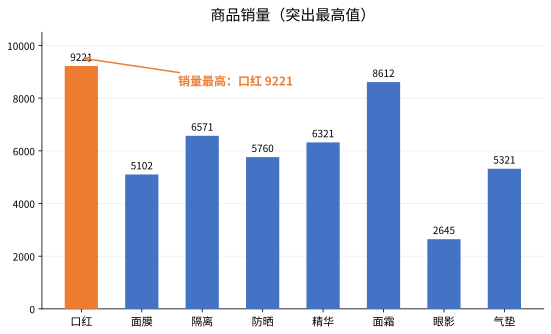 |
| 05 | 层叠柱形图 | `charts/05_层叠柱形图.py` | 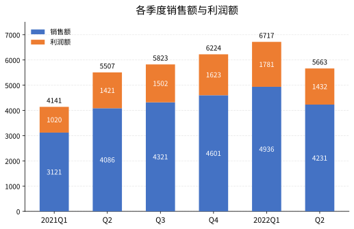 |
| 06 | 蝴蝶图（销量） | `charts/06_蝴蝶图.py` | 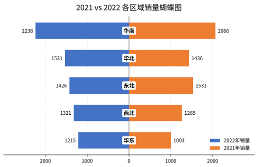 |
| 07 | 蝴蝶图（占比） | `charts/07_蝴蝶图_占比.py` | 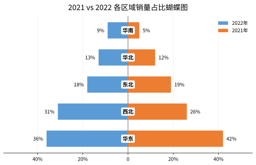 |
| 08 | 数值百分比 | `charts/08_数值百分比.py` | 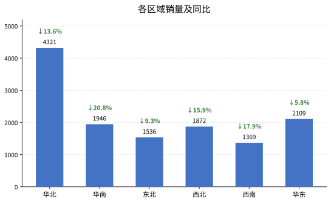 |
| 09 | 对比柱形图 | `charts/09_对比柱形图.py` | 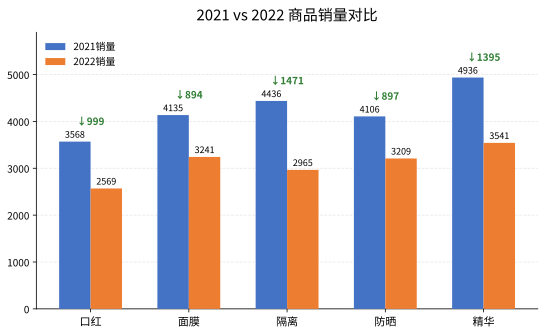 |
| 10 | 甘特图 | `charts/10_甘特图.py` | 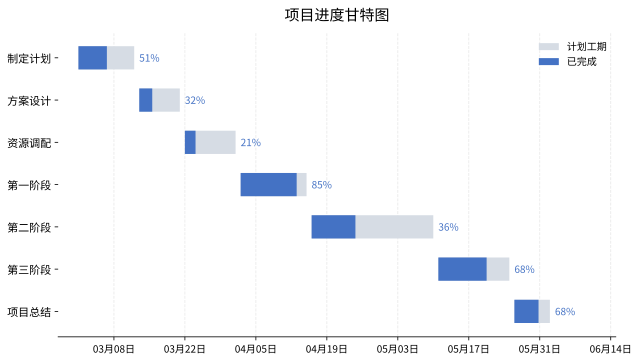 |
| 11 | 平滑折线图 | `charts/11_平滑折线图.py` | 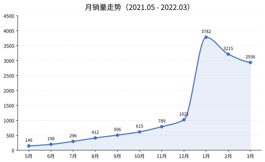 |
| 12 | 菱形走势图 | `charts/12_菱形走势图.py` | 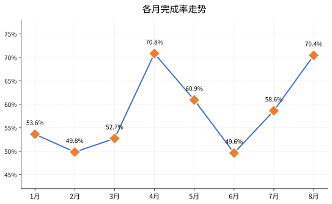 |
| 13 | 对比折线图 | `charts/13_对比折线图.py` | 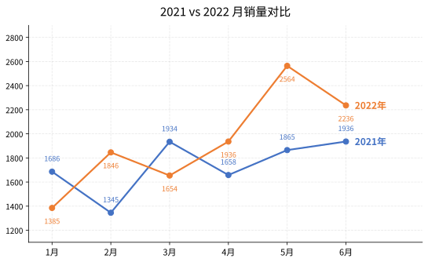 |
| 14 | 单值圆环图 | `charts/14_单值圆环图.py` | 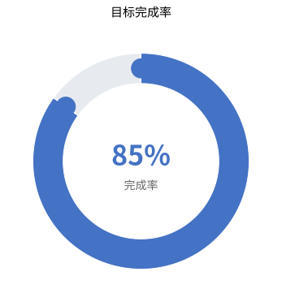 |
| 15 | 水球图 | `charts/15_水球图.py` | 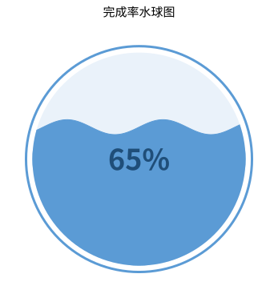 |
| 16 | 波浪水球图 | `charts/16_波浪水球图.py` | 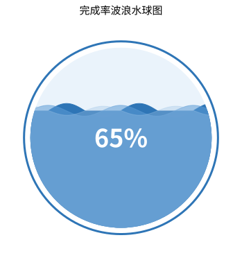 |
| 17 | 玉玦图 | `charts/17_玉玦图.py` | 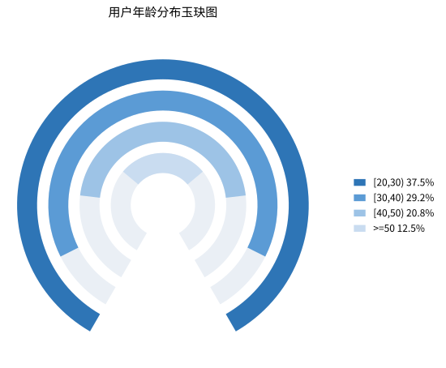 |
| 18 | 跑道图 | `charts/18_跑道图.py` | 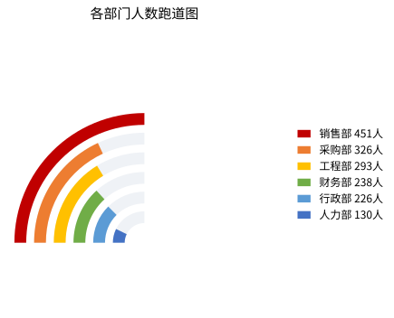 |
| 19 | 南丁格尔圆饼图 | `charts/19_南丁格尔圆饼图.py` | 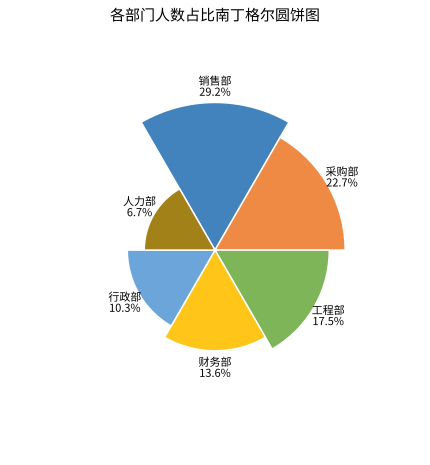 |
| 20 | 南丁格尔圆环图 | `charts/20_南丁格尔圆环图.py` | 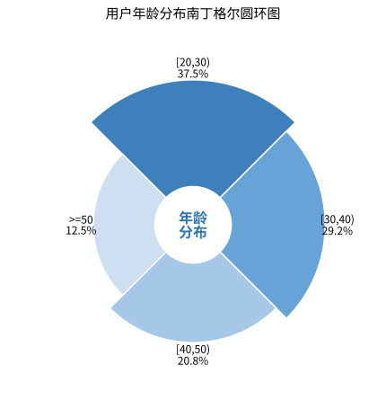 |
| 21 | 南丁格尔圆饼图（PPT 版） | `charts/21_南丁格尔圆饼图_PPT版.py` | 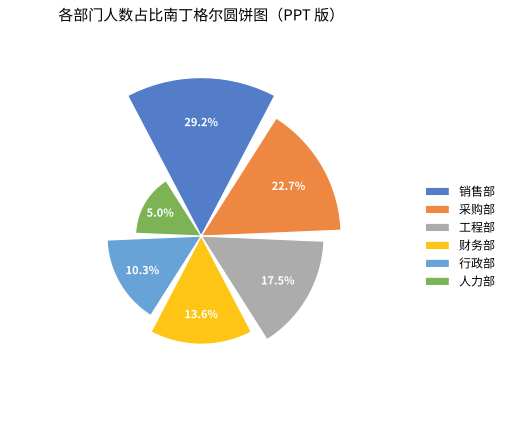 |
| 22 | 仪表盘图 | `charts/22_仪表盘图.py` | 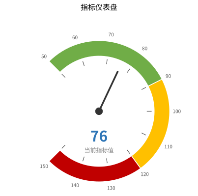 |
| 23 | 柱形折线图 | `charts/23_柱形折线图.py` | 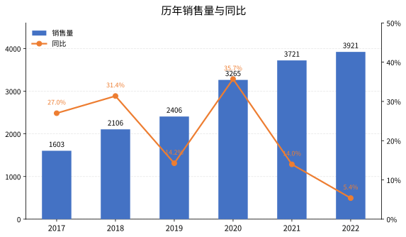 |
| 24 | 目标柱形图 | `charts/24_目标柱形图.py` | 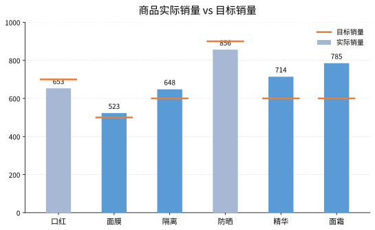 |
| 25 | 子弹图 | `charts/25_子弹图.py` | 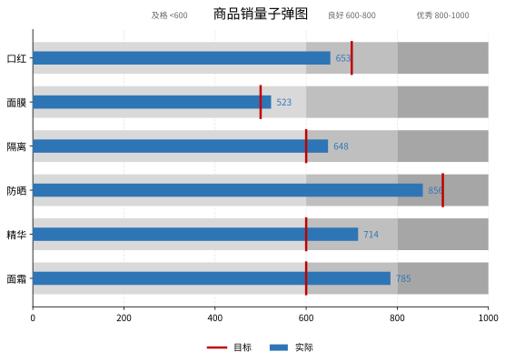 |
| 26 | 柱形圆 | `charts/26_柱形圆.py` | 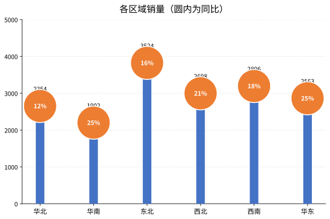 |
| 27 | 簇状柱形折线图 | `charts/27_簇状柱形折线图.py` | 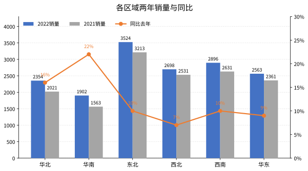 |
| 28 | 复合柱形图 | `charts/28_复合柱形图.py` | 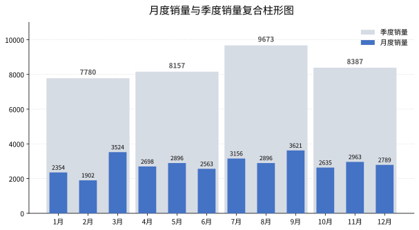 |
| 29 | 滑珠图 | `charts/29_滑珠图.py` | 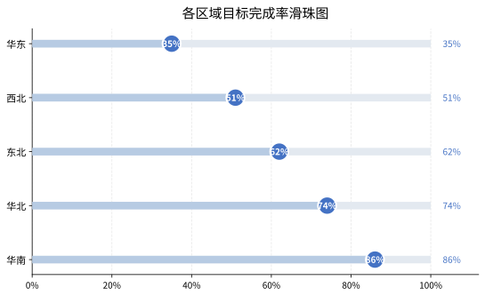 |
| 30 | 对比滑珠图 | `charts/30_对比滑珠图.py` | 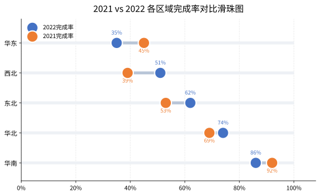 |

## 说明

- 数据直接内嵌在各脚本顶部，与原 Excel 第二章数据一致（Excel 中的公式列已换算为对应数值计算）。
- 所有图表基于 Matplotlib 绘制，渐变柱、水球波纹、玉玦图、跑道图等效果均通过裁剪路径、极坐标条形等技巧实现。
- 字体自动回退（Microsoft YaHei / PingFang SC / Noto Sans CJK SC / SimHei），Windows、macOS、Linux 均可正常显示中文。
